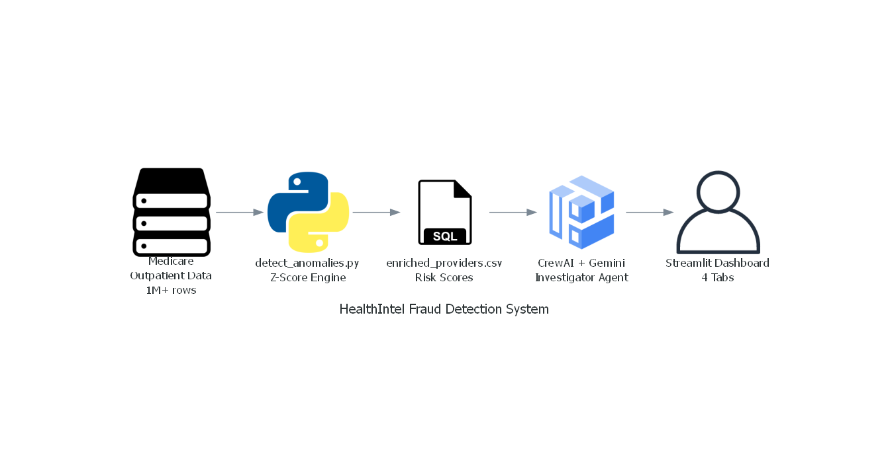
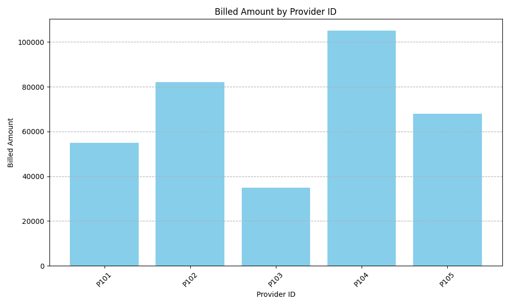

# 🏥 HealthIntel: AI-Powered Healthcare Fraud Detection

[](https://python.org)
[](https://streamlit.io)
[](https://deepmind.google/technologies/gemini/)
[](https://crewai.com)

> An AI agent swarm that analyzes 1 million+ rows of real Medicare outpatient data to detect fraudulent billing patterns, score providers by risk, and generate executive fraud reports automatically.

---

## 🏗️ Architecture



---

## 📊 Dashboard Screenshots

| Executive Overview | Fraud Hunter |
|---|---|
|  |  |

| ROI Strategy | Provider Revenue |
|---|---|
|  |  |

---

## 🎯 What This Project Does

Real Medicare outpatient data (35MB, 1M+ rows) flows through a 4-stage pipeline:

1. **detect_anomalies.py** — Loads raw Medicare data, engineers features, calculates Z-scores per provider, flags statistical outliers, saves `enriched_providers.csv`
2. **investigator_agent.py** — CrewAI agent powered by Google Gemini reads the flagged providers and auto-generates a formal fraud alert email to the CEO
3. **dashboard.py** — 4-tab Streamlit app for business users
4. **my_chart_script.py** — Standalone chart generator for top provider revenue

---

## 📈 Key Results

| Metric | Value |
|--------|-------|
| Dataset Size | 1M+ Medicare outpatient transactions |
| Providers Analyzed | 5,000+ unique providers |
| Fraud Detection Method | Z-Score statistical anomaly detection |
| Risk Threshold | Z-Score > 3.0 = High Risk |
| AI Model | Google Gemini Flash via CrewAI |

---

## 🖥️ Dashboard Features

| Tab | Feature |
|-----|---------|
| 📈 Executive | Revenue filter, full provider table |
| 🕵️ Fraud Hunter | High-risk providers (Z-Score > 3) |
| 🤖 AI Analyst | Chat with data using Gemini AI |
| 💰 ROI Strategy | Audit profit optimization curve |

---

## 🤖 AI Agent — Auto Fraud Report

The `investigator_agent.py` uses **CrewAI + Google Gemini** to:
- Read the enriched provider risk scores
- Identify the highest Z-Score provider
- Write a formal CEO alert email with audit recommendation — automatically

This is **Agentic AI** applied to a real business problem.

---

## 🗂️ Project Structure

```
health-intel-swarm/
├── detect_anomalies.py       # Core fraud engine — Z-score detection
├── dashboard.py              # 4-tab Streamlit business dashboard
├── investigator_agent.py     # CrewAI + Gemini fraud report agent
├── my_chart_script.py        # Provider revenue chart generator
├── data/
│   └── enriched_providers.csv
├── images/
│   ├── architecture.png
│   ├── Executive .png
│   ├── Fraud Hunter.png
│   ├── ROI Strategy.png
│   └── provider_revenue.png
└── requirements.txt
```

---

## ⚙️ Tech Stack

| Layer | Tool |
|-------|------|
| Data Processing | Python, Pandas, NumPy |
| Fraud Detection | Z-Score Statistical Analysis |
| AI Agents | CrewAI + Google Gemini Flash |
| Dashboard | Streamlit |
| Visualization | Matplotlib |
| Data Source | CMS Medicare Outpatient Claims (Public) |

---

## 🚀 Run Locally

```bash
git clone https://github.com/Navin1114-collab/health-intel-swarm.git
cd health-intel-swarm
pip install -r requirements.txt

# Add your Google API key
echo GOOGLE_API_KEY=your_key_here > .env

# Step 1 — Run fraud detection engine
python detect_anomalies.py

# Step 2 — Launch dashboard
streamlit run dashboard.py

# Step 3 — Generate AI fraud report
python investigator_agent.py
```

> **Data:** Download the Medicare Outpatient dataset from [CMS.gov](https://www.cms.gov/Research-Statistics-Data-and-Systems/Downloadable-Public-Use-Files/SynPUFs)

---

## 👤 Author

**Navin Kumar Nagisetty**  
📧 navinnagisetty@gmail.com  
💼 [LinkedIn](https://www.linkedin.com/in/navinnagisetty/)  
🐙 [GitHub](https://github.com/Navin1114-collab)
